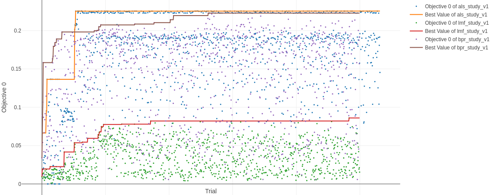

# Sistema de Recomendación - Frontend Web

Sistema Web que implementa un sistema de recomendación basado en el dataset construido
por [este repositorio](https://github.com/tomasdelvechio/sr-tpfinal-gh).

Este sistema implementa 3 tipos de recomendadores:

 * Filtro de popularidad (para nuevos usuarios con ningun o pocos likes)
 * Filtro basado en contenido (para usuarios con una cantidad de likes moderada)
 * Filtro colaborativo vía modelo de la [libreria implicit](https://benfred.github.io/implicit/)

Para ver detalles de la elección de implicit y su optimización, referirse a la [sección correspondiente](https://github.com/tomasdelvechio/sr-tpfinal-gh-web?tab=readme-ov-file#filtro-colaborativo) en este mismo documento.

# Características

 * Recomendación basado en popularidad, contenido y colaborativo
 * Recomendación de repositorios básada en usuarios similares por interacción

# Video de Demo

[Ver video en YouTube](https://youtu.be/Ulo47HTXBhA)

# Instalación

Se asume el repositorio clonado en el dispositivo a instalar.

## Generar archivo de configuración

```bash
cp config.py.example config.py
```

[Se recomienda](https://flask.palletsprojects.com/en/2.3.x/config/#SECRET_KEY) generar una `SECRET_KEY` con el siguiente comando

```bash
python -c 'import secrets; print(secrets.token_hex())'
```

Utilizar el string de salida del comando como valor de `SECRET_KEY` en `config.py`

## Construir entorno

```bash
git clone git@github.com:tomasdelvechio/sr-tpfinal-gh-web.git ~/workspace/sr-tpfinal-gh-web
cd sr-tpfinal-gh-web
python3 -m venv .venv
source .venv/bin/activate
pip install -r requirements.txt
```

## Descarga base de datos

(Opcional) En caso de no querer generar desde cero el dataset, puede descargarse uno de prueba [desde aquí](https://drive.google.com/file/d/1OmUjuhX0G-z35IbDKfVdkd_JOF8sC19A/view?usp=sharing). Ubicarlo en el path relativo `data/data.db`

## Servidor Web

```bash
python flaskr/flask_app.py
```

El sistema estará disponible en http://127.0.0.1:5000

# Filtro colaborativo

Se implementó la [librería implicit](https://benfred.github.io/implicit/) para el motor de recomendación colaborativo.

Principalmente, se consideró que al tomar en cuenta de forma directa el concepto de interacciones basadas en `likes` (sin `dislikes`), se alineaba con el tipo de dataset y recomendación buscados en este trabajo.

Al no ser una librería de las analizadas en la cursada, se realizó una exploración sobre el uso de la misma, ademas de un proceso de validación cruzada para comparar los modelos disponibles y obtener el mejor de ellos con buenos hiperparámetros.

Todo esto se puede observar y reproducir con [la notebook disponible aquí](https://github.com/tomasdelvechio/sr-tpfinal-gh-web/blob/main/notebook_filtrado_colaborativo.ipynb) y el [dataset disponible acá](https://drive.google.com/file/d/1OmUjuhX0G-z35IbDKfVdkd_JOF8sC19A/view?usp=sharing).

A modo de resumen de los experimentos realizados, la libreria [implementa varios modelos](https://benfred.github.io/implicit/api/models/index.html), entre los que se seleccionaron 3 para ser evaluados y optimizados:

 * AlternatingLeastSquares (aka als)
 * BayesianPersonalizedRanking (aka bpr)
 * LogisticMatrixFactorization (aka lmf)

En el proceso de validación cruzada, se optimizó la métrica NDCG (maximización) en base a un TOP 5. Para optimizar, se implementó la [librería optuna](https://optuna.org/), que ofrece en tiempo real una visualización del proceso. Se realizaron 1000 trials para cada modelo, 

El resumen del proceso de optimización se puede observar en el siguente gráfico



Lo que se puede observar es que el modelo que se obtuvieron los mejores scores (Objective 0 es maximización del NDCG para un K=5) es para als. Muy cerca pero menor, estuvo el modelo bpr. Lejos, para el dataset elegido, quedó el modelo lmf.

Se puede ver en la notebook la estrategia de sampling y pruning elegida para el proceso de optimización.

Finalmente, para la versión online, se eligió el conjunto de HP que obtuvieron el mejor score:

 * Score obtenido: 0.22552101789911258
 * factors: 2
 * regularization: 0.18739731219661934
 * iterations: 5
